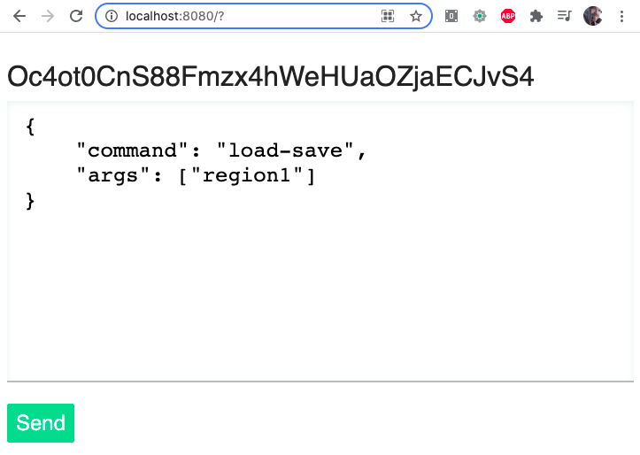

**DFVis** is the preliminary name for a web app that will let you visualize the worlds you create in Bay 12's superlative game, [Dwarf Fortress](http://www.bay12games.com/dwarves/).

### Progress So Far
* [x] Encapsulate Dwarf Fortress in a Docker container
* [x] Send DFHack commands into the container from a web app
* [ ] Extract map data and display it in the browser
* [ ] Fly around the map in 3D
* [ ] Add the sounds of nature and of the fortress

### Architecture Overview

DFVis depends on two processes, which are designed to run in isolation:

A **DFHack daemon** which runs inside a docker container. This process starts Dwarf Fortress with DFHack enabled, and then runs a Lua script that opens a TCP socket, accepts external commands, and runs them in DFHack.

A **web server** built in Node.js which provides the UI and issues commands to the daemon.

### Installation

1. The first step to getting that running is to **build the Docker image**:

  ```
  docker image build --progress=plain -t dfvis ./docker
  ```

  If you don't already have Docker, install [Docker Desktop](https://www.docker.com/products/docker-desktop).

2. Then **boot the container**:

  ```
  docker run --volume $(pwd)/server:/server --volume $(pwd)/lua-lib:/df/df_linux/hack/lua/lib --publish 3333:3333 --env PORT=3333 --name dfvis --interactive --tty --privileged dfvis
  ```

  You can stop the container with `ctrl`+c and then `docker rm dfvis` to remove the container.

3. You need to **start the web server** before firing up the DFHack daemon, because the daemon reaches out to the server (not vice versa):

  ```
  node server
  ```

4. And lastly you can begin a Dwarf Fortress session and **run the daemon**:

  ```
  docker exec -it --privileged --env DFHACK_HEADLESS=1 dfvis /df/df_linux/dfhack +lua -f /server/daemon.lua
  ```

At this point there should be a web site accessible at https://localhost:8080. Which can send any DFHack command as long as it has one (and exactly) argument:




### Other useful commands

Get a shell:
```
docker exec -it dfvis bash
```

Start Dwarf Fortress:
```
docker exec -it dfvis /df/df_linux/df
```

