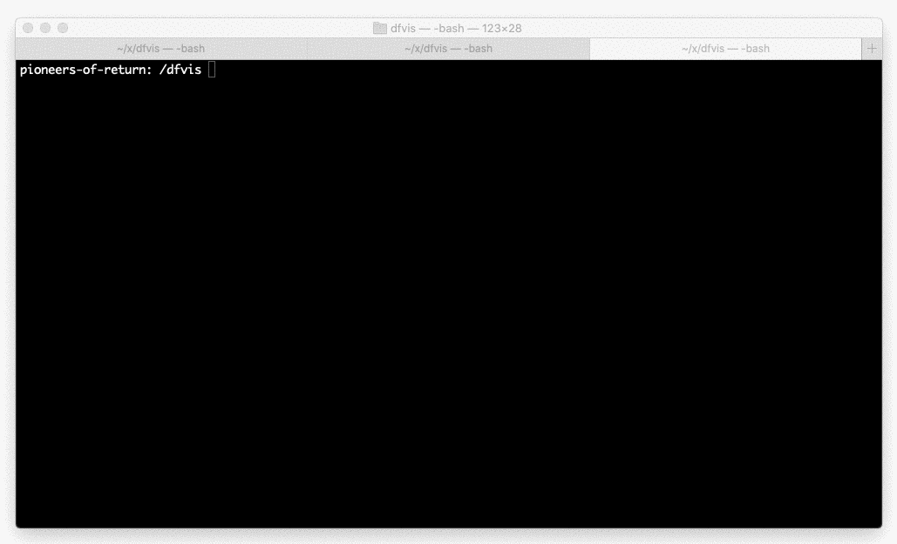

## Commands

Build the image:

```
docker image build --progress=plain -t dfvis ./docker
```

Start the server:

```
docker run -v $(pwd)/server:/server -p 3333:3333 --env PORT=3333 --name dfvis -i -t dfvis
```

Kill the server with `ctrl`+c and then `docker rm dfvis` to remove the container.

Get a shell:
```
docker exec -it dfvis bash
```

Run Dwarf Fortress
```
docker exec -it dfvis /df/df_linux/df
```

## Screenshots

